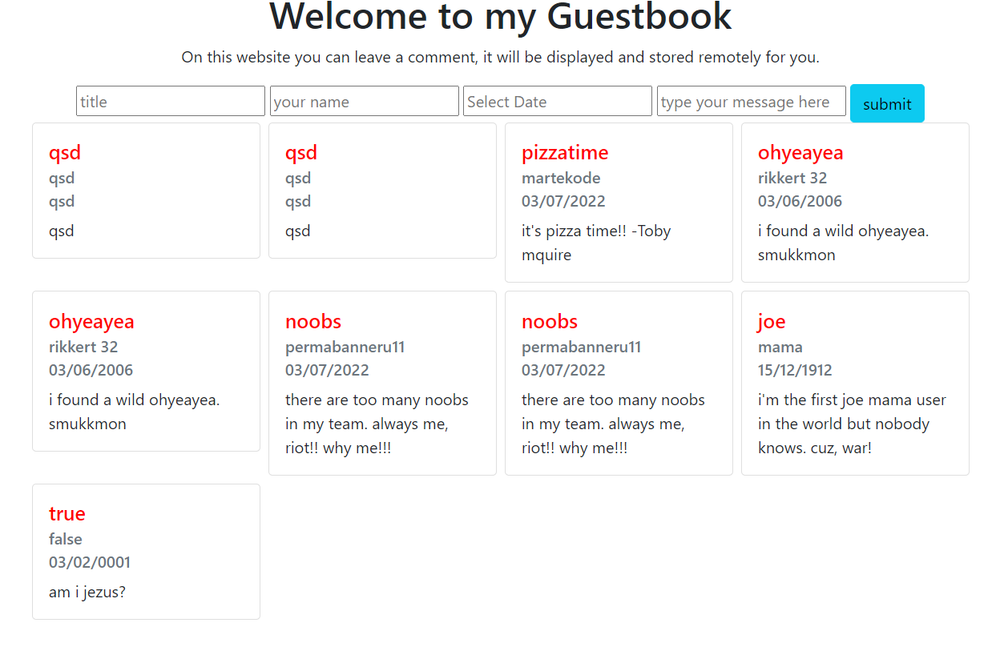

# challenge-php-guestbook

## making a guestbook
as always we first start with the initial commit. this includes 3 files and one folder.(code = folder, 3 files = Poste.php; Postloader.php and index.php). inside the Index file i require the other two.

* # boilerplate
```html
<!DOCTYPE html>
<html lang="en">
<head>
    <meta charset="UTF-8">
    <meta http-equiv="X-UA-Compatible" content="IE=edge">
    <meta name="viewport" content="width=device-width, initial-scale=1.0">
    <link href="https://cdn.jsdelivr.net/npm/bootstrap@5.0.2/dist/css/bootstrap.min.css" rel="stylesheet" integrity="sha384-EVSTQN3/azprG1Anm3QDgpJLIm9Nao0Yz1ztcQTwFspd3yD65VohhpuuCOmLASjC" crossorigin="anonymous">
    <title>Guestbook</title>
</head>
<body>
<div style="text-align: center;" class="container">
    <h1>Welcome to my Guestbook</h1>
    <p>On this website you can leave a comment, it will be displayed and stored remotely for you.</p>
</div>
<div style="text-align: center;" class="container">
    <form method="post">
        <input type="text" placeholder="type your message here">
        <button name="submit" class="btn btn-info">submit</button>
    </form>
</div>


<script src="https://cdn.jsdelivr.net/npm/bootstrap@5.0.2/dist/js/bootstrap.bundle.min.js" integrity="sha384-MrcW6ZMFYlzcLA8Nl+NtUVF0sA7MsXsP1UyJoMp4YLEuNSfAP+JcXn/tWtIaxVXM" crossorigin="anonymous"></script>   
</body>
</html>
```
i created some standard html with an input field inside a form and an accompanying button.
added bootstrap too for some general styling.

* changed some stuff again
```html
    <form method="post">
        <input type="text" placeholder="title">
        <input type="text" placeholder="your name">
        <input type="text" placeholder="Select Date"/>
        <input type="text" placeholder="type your message here">
        <button name="submit" class="btn btn-info">submit</button>
    </form>
```
added the Post class and wrote this:
```php
class Post{
    private $title;
    private $date;
    private $content;
    private $author;

    public function __construct($title, $date, $content, $author){
        $this->title = $title;
        $this->date = $date;
        $this->content = $content;
        $this->author = $author;
    }
    public function getTitle(){
        return $this->title;
        }
    public function getDate(){
        return $this->date;
        }
    public function getContent(){
        return $this->content;
        }
    public function getAuthor(){
        return $this->author;
        }
    
}
```
* ## created logic for button press
```php
if(isset($_POST['submit'])){
    try{
        isEmpty();
    }catch(Exception $e){
        echo $e->getMessage();
    }  
}
```
as you can see it has a function and some error handing,
let's show you that real quick 
```php
require './code/code.php';
```
new file
```php
declare(strict_types=1);

function isEmpty(){
    $keys=["title","name","message","author","date"];
    foreach($keys as $key){
        if($_POST[$key] == ''){
            throw new Exception('empty '. $key.' input');
        }
    }
}
```
keys array to exclude button from the empty check, and throwing an exception if there is something empty
________
if nothing is empty then we're going to make a new POST object and pass the $_POST data as parameters.
```php
function isEmpty():POST{
    $keys=["title","name","message","date"];
    foreach($keys as $key){
        if($_POST[$key] == ''){
            throw new Exception('empty '. $key.' input');
        }  
    }
    $post = new Post($_POST['title'],$_POST['date'],$_POST['message'],$_POST['name']);
    return $post;
}
```
slight change in the button logic 
```php
if(isset($_POST['submit'])){
    try{
       $post = isEmpty();
       var_dump($post);
    }catch(Exception $e){
        echo $e->getMessage();
    } 
     
}
```
improvements
```php
if(isset($_POST['submit'])){
    try{
       $post = isEmpty();
       $postloader = new PostLoader();
       #var_dump($post);
       $postloader->savePost($post);
    }catch(Exception $e){
        echo $e->getMessage();
    } 

     
}
```
this is the postloader class: 
_______
i had to pass everything individually bacause otherwise the ecoding was empty

```php
class Postloader{

    public function savePost(POST $post){
        $data=[];
        $data['title']=$post->getTitle();
        $data['date']=$post->getDate();
        $data['message']=$post->getMessage();
        $data['author']=$post->getAuthor();;
        #var_dump($data);
        $dataJSON = json_encode($data);
        file_put_contents('D:\WebPages\www\challenge-php-guestbook\db\db.txt',$dataJSON,FILE_APPEND);
    }
}
```
changes needed to be made, sinds json_decode is very peculiar at decoding strings it proved very difficult to make this happen. Tim found a quick way tot do it by decoding the current file into an array and then pushing our data array allso in there before encoding it and putting it into the file.
____
I first didn't want to do it sinds it sounded and seemed like there were too many steps. I ended up searching the entire weekend for better solutions but always ended up with the NULL return because of a bad string. I tried utf8_encode,str_replace to always have "" dubble quotes but either way didn't work. So i ended up using tims method in my way.
```php
    public function savePost(POST $post){
        $data=[];
        $data['title']=$post->getTitle();
        $data['date']=$post->getDate();
        $data['message']=$post->getMessage();
        $data['author']=$post->getAuthor();
        $currentFile = json_decode(file_get_contents('D:\WebPages\www\challenge-php-guestbook\db\db.txt'),true);
        $currentFile[]= $data;
        $dataJSON = json_encode($currentFile);
        
        file_put_contents('D:\WebPages\www\challenge-php-guestbook\db\db.txt',$dataJSON);
    }
```
now its time to do fil_get_contents. we are going to place this indide the Postloader class. it will be a public function calles getPosts. after that we will let it display in the view on our page. And finally add some logic so it only displays 20 max.
_________
the beginning:
```php
    public function getPosts(){
    }
```
adding logic to getPosts
```php
        $stdPosts = json_decode(file_get_contents('D:\WebPages\www\challenge-php-guestbook\db\db.txt'));
        var_dump($stdPosts);

```
for now a simple var_dump is enough.. after this we can work on the vieuw to display 20 posts maximum with  a for loop. It'll probablu works with a <?php for ($i=0;i<20;$i++): ?> and closing <?php endfor;>. maybe it doesn't but then ill just check how many there are first and display based on that. 
___
made it into a return
```php
    return $stdPosts;
```
some standard code to display it...
```html, php
<div class="container">
    <div class="row">
        <?php for ($i=0; $i < count($posts);$i++): ?>
            <div class="col-sm-12 col-md-6 col-lg-3">
                <div class="card">
                    <div class="card-body">
                        <h5 class="card-title"><?= $posts[$i]->{'title'}; ?></h5>
                        <h6 class="card-subtitle mb-2 text-muted"><?= $posts[$i]->{'author'}; ?></h6>
                        <h6 class="card-subtitle mb-2 text-muted"><?= $posts[$i]->{'date'}; ?></h6>
                        <p class="card-text"><?= $posts[$i]->{'message'}; ?></p>
                    </div>
                </div>
            </div>
        <?php endfor;?>    
    </div>
</div>
```

```php
declare(strict_types=1);
require './code/Post.php';
require './code/Postloader.php';
require './code/code.php';
$postloaderInit = new PostLoader();
$posts = $postloaderInit->getPosts();
```
i placed an init postloader to load the messages
i will implement a check later to check if the file isn't empty.
_______
changed to this :
```php
declare(strict_types=1);
require './code/Post.php';
require './code/Postloader.php';
require './code/code.php';
$_DIR_ = 'D:\WebPages\www\challenge-php-guestbook\db\db.txt';
if(!file_get_contents($_DIR_) == ''){
    $postloaderInit = new PostLoader();
    $posts = $postloaderInit->getPosts();
}else{
    $posts = json_decode('[{"title":"your","date":"show","message":"here","author":"posts"}]');
}
```
default given if file empty and when you submit it overwrites..
* # logic for only displying 20 posts
```php
      <?php if (count($posts)< 20): ?>
        <?php for ($i=0; $i < count($posts);$i++): ?>
            <div class="col-sm-12 col-md-6 col-lg-3">
                <div class="card">
                    <div class="card-body">
                        <h5 style="color:red;" class="card-title"><?= $posts[$i]->{'title'}; ?></h5>
                        <h6 class="card-subtitle mb-2 text-muted"><?= $posts[$i]->{'author'}; ?></h6>
                        <h6 class="card-subtitle mb-2 text-muted"><?= $posts[$i]->{'date'}; ?></h6>
                        <p class="card-text"><?= $posts[$i]->{'message'}; ?></p>
                    </div>
                </div>
            </div>
        <?php endfor;?>
        <?php elseif (count($posts) > 20): ?>
          <?php for ($i=0; $i < 20 ;$i++): ?>
            <div class="col-sm-12 col-md-6 col-lg-3">
                <div class="card">
                    <div class="card-body">
                        <h5 style="color:red;" class="card-title"><?= $posts[$i]->{'title'}; ?></h5>
                        <h6 class="card-subtitle mb-2 text-muted"><?= $posts[$i]->{'author'}; ?></h6>
                        <h6 class="card-subtitle mb-2 text-muted"><?= $posts[$i]->{'date'}; ?></h6>
                        <p class="card-text"><?= $posts[$i]->{'message'}; ?></p>
                    </div>
                </div>
            </div>
          <?php endfor;?>   
      <?php endif;?> 
```
changing date to a generated date instead of input.
```php
function isEmpty():POST{
    $keys=["title","name","message"];
    foreach($keys as $key){
        if($_POST[$key] == ''){
            throw new Exception('empty '. $key.' input');
        }  
    }
    $post = new Post($_POST['title'], date("d-m-Y") ,$_POST['message'],$_POST['name']);
    return $post;
}
```
also used htmlspecialchars
```php
    public function __construct($title,$date, $message, $author){
        $this->title = htmlspecialchars($title , ENT_QUOTES);
        $this->date = $date; 
        $this->message = htmlspecialchars($message , ENT_QUOTES);
        $this->author = htmlspecialchars($author , ENT_QUOTES);
    }
```